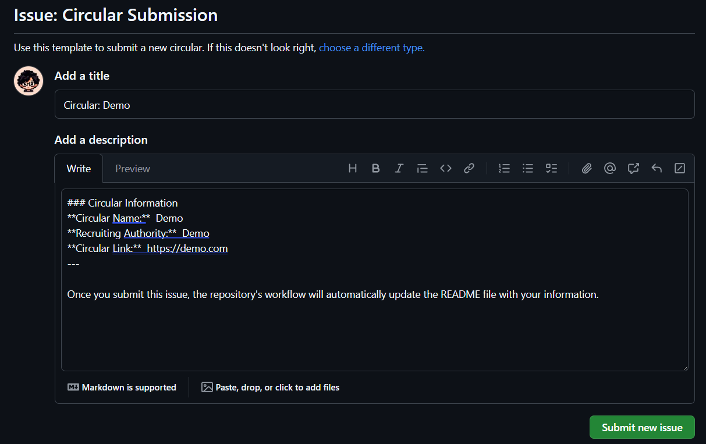

## A simple github workflow aiming to gather awareness about adding **ECE (Electrical & Computer Engineering) - RUET** to the eligible degree list of various job circulars in Bangladesh.

### What is this?
Basically we aim to collect job circulars that are missing our subject **ECE (Electrical & Computer Engineering)**. We will collect the circulars in a structured way and update the README file of this repository with the circulars automatically.

### To-Do
- [x] Gather a list of job circulars that are missing ECE.
- [ ] Submit an application to the higher authority to add ECE so that ECE gets added to the eligible degree list of various job circulars in Bangladesh.

### How to use?
- If you find a job circular that is missing ECE, you can submit a new issue using the `Circular Submission` template.
- For this, you need to fill in the required information and submit the issue.
- Click this [**LINK**](https://github.com/sajidshahriar72543/jobsECE-RUET/issues/new/choose) and tap **Get Started** to submit a new issue.
- Fill in the required information and submit the issue.
Your form should look like this:

*here Demo is a sample input*
- Once you submit the issue, the repository's workflow will automatically update the README file with your information.
- To verify your submission, you can check the README file of this repository.
- To contribute to this repository, you can fork this repository and submit a pull request.
  
 

***Everyone is requested to help gathering this awareness.***
 

Made with 💔 by [**Sajid Shahriar**](https://github.com/sajidshahriar72543)

----

